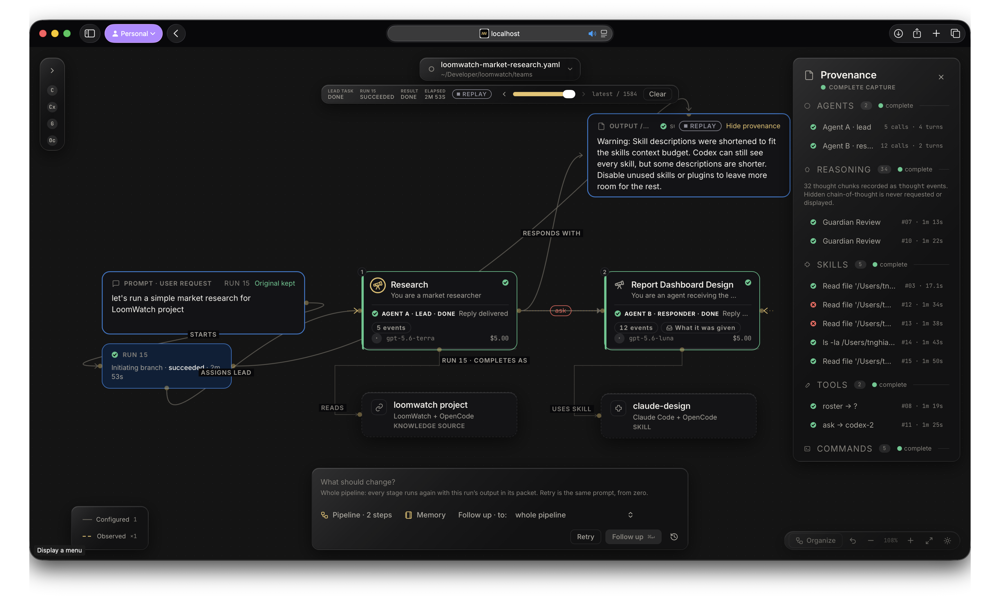
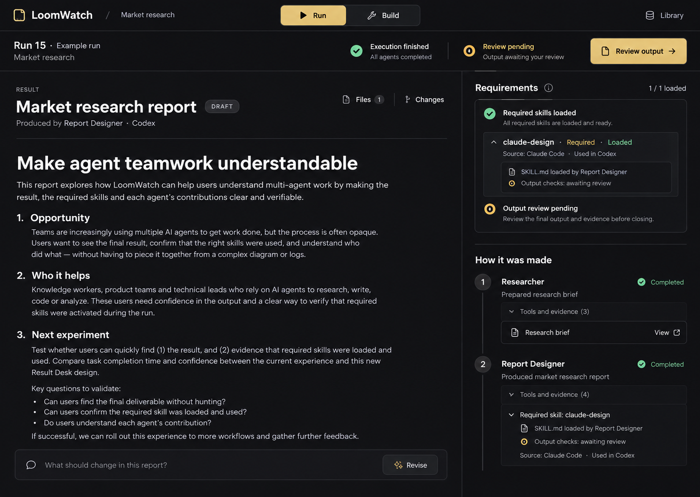
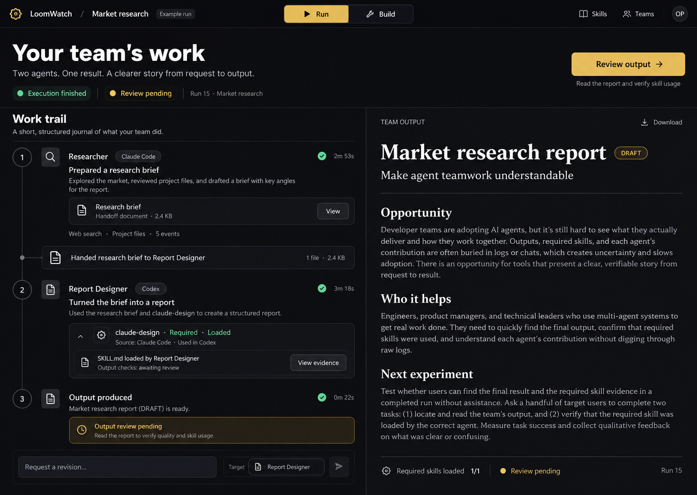
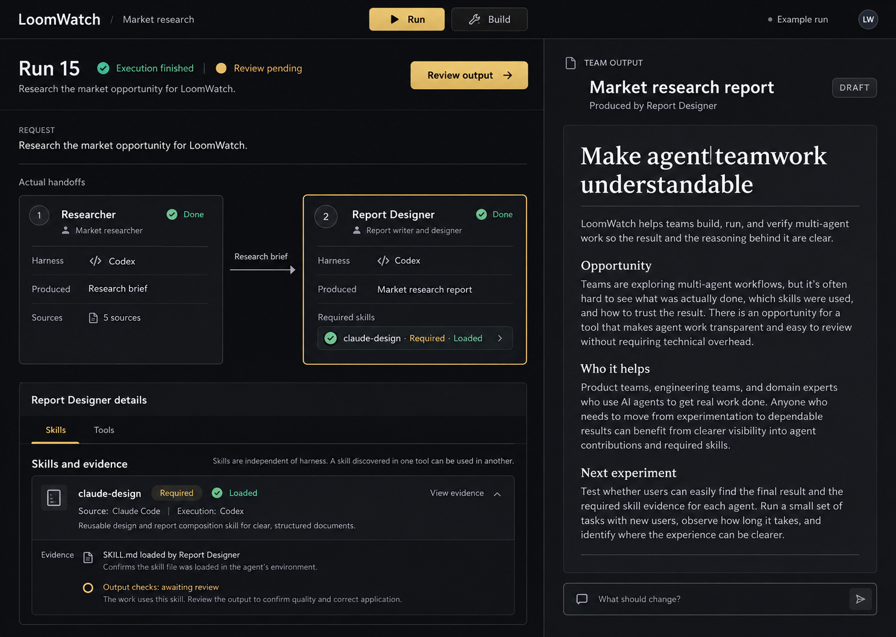

# LoomWatch: lead with the work, make the process inspectable

Design proposal · 14 September 2026 · Discussion draft, not an implementation specification

## Recommendation

Give LoomWatch two equally prominent modes: **Run** for following work and reviewing results, and **Build** for composing the team that produces them. Keep the same team, run selection, and agent identity across both. The primary object in Run is the team's deliverable. The primary object in Build is the workflow and its output requirements.

The first screen should answer, in order:

1. What did the team produce, or what is it working toward?
2. Did it satisfy my required skills and output requirements?
3. Who contributed what, and what happened between them?

The graph remains useful for construction and investigation. It should not be the only way to understand a run.

## User direction

- The final output must be immediately identifiable.
- Skills connected to an agent are requirements, not suggestions.
- Locally discovered skills should work across harnesses: specifically, use `claude-design` found in Claude Code with a Codex agent.
- Run and Build should serve their respective audiences equally.
- Explore the UX before changing the application.

The attached screenshot and existing design documents are evidence and context. Historical requirements about placing everything on one canvas are not new user instructions or constraints against this redesign.

## Bounded review of the current screen

Evidence: the user-provided screenshot, inspected in this conversation. These are reading tasks within one captured screen, not a tested multi-screen journey.

| Step | Reading task | Health | Evidence and implication |
| --- | --- | --- | --- |
| 1 | Identify the deliverable | Poor | The output is a small node at the upper right, with a truncated heading. Its visible content is a skill-context warning. Most space is occupied by the graph or empty canvas. |
| 2 | Determine whether work is complete | Misleading | Lead task, run status, result status, agent states, and capture completeness all claim some form of completion. None directly establishes that the requested market research exists. |
| 3 | Verify a connected skill | Poor | `claude-design` is connected to the report agent, but the Skills panel shows file-operation titles and failed reads. There is no readable comparison between this required skill and its runtime evidence. |
| 4 | Understand the handoff | Poor | Control relationships, configured connections, observed calls, resource attachments, and result relationships occupy the same visual space. Several lines cross or take long routes. |
| 5 | Decide what to do next | Mixed | Follow-up and retry exist, but the default composer addresses the whole pipeline, while the result needs attention. Clicking the output currently exposes provenance rather than opening a dedicated deliverable reader. |

Useful foundations: named agents, a durable original request, explicit source/skill objects, recorded events, replay, handover inspection, and a consistent visual language. Preserve these capabilities while changing their hierarchy.

Accessibility risks visible in the screenshot include very small uppercase metadata, low apparent contrast on edge labels, truncated identifiers, and reliance on spatial navigation. Actual contrast ratios, keyboard navigation, screen-reader behavior, responsive layouts, and live state transitions were not tested. This is a screenshot review supported by code inspection, not a full accessibility audit.

The screenshot does not establish why the warning became the visible output, whether more content exists, or whether `claude-design` actually loaded. Those require inspecting that run's events. Do not silently turn this screenshot into evidence of a confirmed backend failure.

## Run: a stable home for results

Use a result reader for roughly two thirds of the workspace, with an expandable work trail beside it. Pin the result to normal page layout so users never need to pan or zoom to find it. Keep the composer attached to this workspace rather than floating over content.

The header names the job in ordinary language, such as “Market research,” rather than making its YAML filename the product title. Keep configuration paths in details. Show a selected run and its time quietly. Move replay controls into History or the evidence view; an archived run should initially show its final state, with a deliberate action to enter replay.

The result area contains the actual answer or rendered artifact, a useful title, its producer, and a concise requirements summary. Support text, files, reports, dashboards, code changes, and external results through appropriate viewers. A run may have multiple deliverables, with one primary result and supporting files. Intermediate handoffs do not automatically become final deliverables.

Separate status dimensions:

| Dimension | Example wording | Meaning |
| --- | --- | --- |
| Execution | Running / Waiting for you / Execution finished / Failed | What the processes are doing |
| Deliverable | In progress / Draft / Ready / Missing | Whether the requested result exists and satisfies its configured acceptance conditions |
| Required skills | 1 of 1 loaded / Missing required skill / Verification unavailable | Evidence for the requirements attached to the responsible agent |
| Capture | Event capture complete / Some events missing | Whether observable telemetry was captured, only in evidence details |

Do not label the whole result successful solely because a process exited normally. Do not label a skill verified solely because event capture is complete. Human review is a configured requirement when appropriate, not a mandatory extra approval step for every run.

When only a warning or status message was produced, retain it in diagnostics and show “Expected report not produced.” This depends on typed output and diagnostic channels; do not implement it as a brittle filter for messages beginning with “Warning.”

Keep a stable result location throughout the lifecycle. Before execution it says what will be produced. During execution it shows progress or partial content. While waiting for the user, the blocking question is prominent and associated with its stage. On failure it preserves useful partial work and names the next action. After a rerun it shows the new version with a comparison to the preceding output.

## The work trail: contributions and artifacts

Replace the default flat event inventory with a compact account of the work:

1. **Researcher** — prepared a research brief. Open the brief.
2. **Handoff** — passed that brief and the agreed instructions to Report Designer. Inspect what was received.
3. **Report Designer · Codex** — produced the report. See `claude-design` loading evidence and output checks.

Each stage expands into inputs, contribution, required skills, tools/sources, and raw events. Tool calls use meaningful names and outcomes, with command lines, paths, arguments, and timestamps one level deeper. Failed operations remain visible in context, including later recovery. Main-stage summaries should point to source events and artifacts; generated descriptions must not invent causality or claim a skill influenced a specific paragraph without evidence.

Parallel work is grouped under its actual parent contribution. A fan-out can read “Three researchers worked in parallel”; expand to see each branch. Do not flatten concurrent branches into a false sequence. Conversations between agents stay under the relevant handoff, with detailed routing available in Trace.

A useful longer-term interaction is selecting a section of the result to highlight the supporting stages and sources. Ship this only when artifact/source relationships exist; proximity on the graph is not provenance.

## Build: start with the deliverable

For a new workflow, ask for the expected output: for example, a research report with sources and a dashboard file. Then define the agents that will contribute to it. Existing workflows retain their configuration and do not need a forced onboarding wizard.

The Build layout uses a library at left, a structured workflow in the center, and a selected-stage inspector at right. Show a persistent output specification at the end of the workflow. A first-time builder should know what the team will deliver before choosing every model or tool.

An agent has a plain-language role, execution harness, expected contribution, and required skills. Selecting or dragging a skill onto the agent attaches it directly and displays a chip. The same interaction has a keyboard-accessible “Add skill” alternative. Expand the inspector to configure detailed skill requirements and dependencies.

Use one ordinary arrow meaning: **passes work to**. Name the handoff artifact on the edge when helpful. Skills and tools are attached properties of agents rather than additional graph nodes by default. Sources appear within agent inputs. Run status and the original prompt do not need nodes or arrows. Trace can expose actual delegation relationships when investigating a run; planned versus observed views must be labeled and kept distinguishable.

Graph editing still supports branching, joins, review checkpoints, and agent delegation. A guided pipeline is the default layout, with advanced graph structure available when a team actually needs it.

Edits in Build create the next team revision. Run continues to show the immutable configuration used for the selected historical run. A small “Changes apply to next run” notice prevents the UI from implying that rewiring changes past evidence.

## Required skills: verification is a product capability

Scanning, delivery, activation, and correct application are separate facts. A local scan makes skills available for selection; it cannot establish what a later agent did. The [Agent Skills integration guide](https://agentskills.io/client-implementation/adding-skills-support) similarly separates discovery, disclosure, and activation.

For the user's example, Build should say:

> Report Designer · runs in Codex  
> Required skill: claude-design  
> Found locally in Claude Code  
> LoomWatch will prepare this skill for Codex when the run starts.

Run should replace that promise with evidence for that specific agent attempt:

| State | Evidence needed | User-facing meaning |
| --- | --- | --- |
| Found | Exact selected local bundle and identity | Available to attach |
| Prepared | Whole selected bundle delivered to the target agent workspace, with revision identity | Ready for this agent to load |
| Loaded | Successful native activation/read of the selected instructions, or adapter-confirmed delivery of the full instructions into the agent context | Required instructions supplied to the agent |
| Checks passed | Explicit output/process criteria checked, with evidence and evaluator identity | The named criteria passed; no claim of universal compliance |

The default compact row shows the strongest established state and an evidence link. Detailed receipts expose the bundle identity, agent, run attempt, loading mechanism, and supporting events. Match evidence to the selected skill revision and agent, not merely a tool title containing the word “skill.” A read of a different same-named skill must not satisfy this requirement. One agent loading a skill must not satisfy another agent's obligation.

For connected required skills, propose an execution contract: prepare the exact bundle, activate its full instructions before the agent's substantive task, and record the receipt. A known delivery or activation failure blocks that stage and gives a precise repair action. If a harness cannot provide a verifiable activation path, identify this before starting the stage and offer a supported path. Never silently downgrade the requirement or auto-waive it. Uncertain evidence means the output cannot carry a claim that the requirement passed.

Reading instructions still does not prove that every natural-language instruction was followed. If a skill has executable checks, required artifacts, or a structured review, run them and expose what they checked. A model review is labeled as a model assessment. When no such criteria exist, show “Loaded; output checks not defined” rather than “Verified applied.” Do not require users to author tests for ordinary skills before they can use them.

The familiar experience should remain simple: **choose skill, attach it, run, see its receipt**. Adapter mechanics and evidence collection are LoomWatch's responsibility.

## Share and reuse across harnesses

Make the library skill-centered. The source harness is an origin label, while the execution harness is selected on each agent. A skill found under Claude Code should not appear confined to a “Claude-only” drawer. The [Agent Skills specification](https://agentskills.io/specification) describes a bundle with instructions and optional scripts, references, assets, and compatibility metadata; portability needs to account for those resources and requirements.

Give each selected bundle a stable identity and exact revision. A name alone is insufficient when several installations contain different versions. Show duplicate or conflicting local variants explicitly. A run pins its chosen revision; updates can be reviewed for the next run rather than silently changing prior records.

A skill detail page can show its purpose, origin, instructions, dependencies, where it is attached, and evidence-backed use history. “Worked in Codex” means a recorded test/run with that revision and environment; “Can be delivered to Codex” is a narrower claim. Missing tools or harness-specific instructions are concrete readiness issues, not blanket incompatibility based on origin.

Build sharing in stages:

1. **Local reuse:** the same discovered skill can attach to agents using different harnesses.
2. **Portable bundle:** export/import the whole skill and dependency description with its revision; preserve attribution. Credentials and unrelated local files are not skill content.
3. **Reusable workflow:** save the team structure, output requirements, pinned skills, and declared dependencies. Keep private run inputs and history separate from this reusable definition.
4. **Shared library:** add team publishing and updates when the local reuse experience is reliable.

“Reuse this workflow” belongs beside a good output because the result demonstrates what the reusable team can produce. “Use this skill” belongs in the library and skill detail. These are different reuse units.

## What the current code already supports

- Cross-harness bundle placement is implemented in [workspace.rs](../../../crates/loomwatch-backend/src/workspace.rs) and documented in [ADR 0019](../../decisions/0019-cross-harness-skill-delivery.md). Claude Code receives `.claude/skills`; Codex receives `.agents/skills`. Bundles are prepared per agent. This is code inspection, not a live test of the selected skill.
- [coverage.ts](../../../ui/src/components/run/coverage.ts) deliberately measures capture completeness. Preserve that semantic and change its presentation so it cannot be mistaken for requirement satisfaction.
- [events.ts](../../../ui/src/lib/watch/events.ts) currently classifies a tool as skill activity when its name/title contains `skill`. That heuristic is insufficient to verify the connected bundle and successful activation.
- [StoryNodes.tsx](../../../ui/src/components/run/StoryNodes.tsx) presents output using the prompt-card shell and opens provenance when a terminal output is clicked. A dedicated result reader is a clear UI seam.
- [Workspace.tsx](../../../ui/src/components/Workspace.tsx) assembles prompt, run, output, and relationship edges. Separate Run presentation from Build presentation while sharing the existing run/configuration data.

Do not infer which of these implementation behaviors produced the exact screenshot without inspecting that run. Do not replace existing in-progress changes in the workspace as part of this design proposal.

## Suggested delivery order

**First: make existing runs understandable.** Introduce Run and Build, a fixed result reader, explicit missing/draft/ready output states, and a short contribution trail. Remove decorative control edges from Run. Keep diagnostics accessible. This gives immediate benefit with existing events.

**Second: close the required-skill loop.** Connect each configured bundle to per-agent delivery and activation receipts, plus concrete output checks when defined. Replace generic Skills counts with the required-versus-observed view. Build needs to disclose whether the chosen harness can satisfy verification before running it.

**Third: make reuse trustworthy.** Stable bundle identities, version pinning, readiness checks, local cross-harness reuse, then export/import and shared workflow definitions.

Visual restructuring and skill verification are both core work. Do not ship stronger green claims before the evidence contract exists.

## How to evaluate the design

Use the same two-agent research task across concepts, plus a failed required-skill case and a parallel research case. Proposed usability criteria, not measured results:

- After five seconds, the user can point to the team's final deliverable and state whether it is ready.
- Within ten seconds, the user can establish whether the required `claude-design` loaded for the Codex report agent and open the supporting evidence.
- The user can explain what Researcher handed to Report Designer without decoding an edge legend.
- The user can attach a locally discovered Claude Code skill to Codex without manually copying files.
- A missing load receipt, a failed file read, or a telemetry gap never appears as a passed requirement.
- A user can revise the report stage while seeing which upstream inputs will be reused and which downstream stages will run again.
- The Run view remains understandable without color, with keyboard navigation, at enlarged text sizes, and in a narrow viewport. These require prototype testing.

## Visual exploration

Three image concepts explore different information hierarchies in the existing Obsidian & Gilt palette: a deliverable-led reader, a contribution journal with a pinned result, and a restrained workflow lane with a fixed result pane. They are illustrative mockups with example content, not screenshots of implemented functionality or evidence from Run 15.

Recommended direction: make the deliverable-led reader the Run default, incorporate the contribution journal's handoff detail, and reserve spatial workflow editing for Build. Choose the interaction model before polishing individual cards or edge routing.

The following order matches the generated images displayed in the conversation. Images were generated with the built-in Image Generation tool using the supplied screenshot, the product's existing design tokens, and the brief above. Exact prompts are recorded in the conversation's three image generation calls.

### Option 1

### Option 2

### Option 3

### Mockup limitations

These are layout explorations. Their sample agent activity and report content are invented and marked as an example run. They do not establish real skill usage or market findings. Some generated microcopy still says “used” where only loading evidence is shown; implementation must use the stricter state meanings specified above. The first image also repeats skill details in two places; keep the summary in Requirements and expand the detailed receipt in only one place at a time. All three depict a review-pending example; a human approval step is not required for every workflow. No interactions, responsive behavior, or runtime checks have been implemented or tested.

## Implementation — 2026-09-14

Option 3 is implemented as a [working interaction prototype](prototype/README.md) and the production
Run surface. The application now has Run/Build navigation, a fixed Markdown output reader, focused
skill/tool graphs and receipts, a direct responder selector, and required-skill instruction delivery
across harnesses. Explicit final-answer metadata separates progress from the delivered report.

See [ADR 0020](../../decisions/0020-delivery-lane-and-required-skill-receipts.md) for exact semantics and
[UI visual QA](../../../ui/design-qa.md) for tested states. Older runs cannot retroactively acquire
instruction-delivery receipts. The prototype's persistent report-review flow remains exploration; production supports focused
per-agent and whole-team evidence graphs, direct cross-harness skill selection, and existing review stops.
